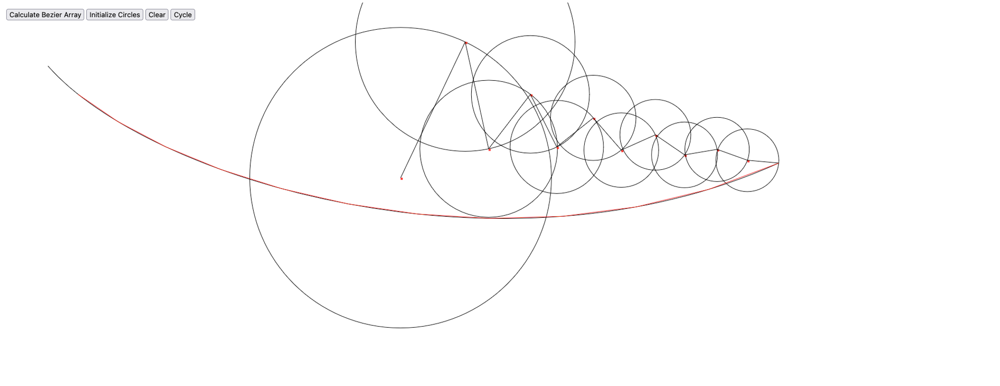

# Epicycle Drawing Generator #



## About ##
This web app allows you to draw any arbitrary smooth curve you'd like, and cycle through a superposition of rotating circles trace an outline of the curve. The implementation of the curves is done with Bezier curves, and the circles are generated with the Discrete Fourier Transform (DFT). The resulting points are stored in a MySQL database.

## MySQL Database Setup ##
To run the web app, we need to first setup the MySQL database, named 'complex', with a TABLE 'drawings2':

```
sudo systemctl start mysql
```
```
mysql -u root -p
```

Then once logged in, we can run:

```
CREATE DATABASE complex;
```
```
USE complex;
```

And create the appropriate table:

```
CREATE TABLE DRAWINGS2 (
	id INT NOT NULL AUTO_INCREMENT,
	x_points INT DEFAULT NULL,
	y_points INT DEFAULT NULL,
	PRIMARY KEY (id)
);
```

## Running the application ##

Next, from within the api folder, we can configure the Flask Environmental variable, and run the Flask application file.

```
export FLASK_APP=app.py
```

```
python3 app.py
```


